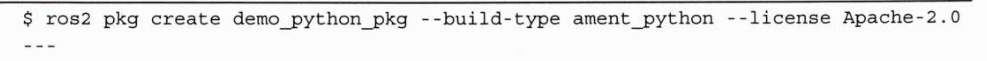

# ROS2 环境

## Install

推荐: **fishros.org.cn**来进行安装

一键安装ROS2：

```
官网：https://fishros.org.cn/forum/topic/20/%E5%B0%8F%E9%B1%BC%E7%9A%84%E4%B8%80%E9%94%AE%E5%AE%89%E8%A3%85%E7%B3%BB%E5%88%97
```


```
wget http://fishros.com/install -O fishros && . fishros
```


> 关于root权限：在reboot中一直按	ESC进入回复界面后 选择root.... 
>
> 进入命令行输入，添加当前用户为root权限
>
> ```
> mount -o remount,rw /
> adduser your_username sudo
> // 检查用户是否添加
> groups your_username
> ```
>
> 重启即可

## 针对节点创建

通过**功能包**创建：



关于**终端环境变量**设置，解决因环境变量报错问题

```
source install/setup.bash
echo $AMENT_PREFIX_PATH
```


## WorkSpace

约定：功能包放在**/src中（同vue)

构建功能包

添加XML依赖

```
  <depend>rclpy</depend>

  <depend>demo_python_pkg</depend>
```

执行构建

```
colcon build
```

依赖检查命令

```
rosdep install -i --from-path src --rosdistro foxy -y
```

注意 构建的setup.py需要包含你所编写的python代码

```xml
    entry_points={

        'console_scripts': [

            'python_node1 = demo_python_pkg.python_node:main',

            'person_node = demo_python_pkg.person_node:main'

        ],
```

构建清理(mark):

```shell
rm -rf install build log
```

执行节点

```
ros2 run {包名} {节点名}
```

exp:

```
ros2 run demo_python_pkg python_node1
```

> PS:该部分为目前为止的issue点解决汇总
>
> 1、关于图片放在虚拟机中的权限问题
>
> ```gas
> cd {图片目录}
>
> sudo chown {终端名称}:{终端名称} xx.jpg(图片名称)；
> ```
>
> 该部分旨在为 图片使用者授权
>
> 2、关于构建
>
> 这里是一个提示，构建的时候记得切换回工作目录而非src目录
>
> 3、关于人脸识别的TypeError问题：
>
> 灰度转换
>
> ```
> 通过github上的issue提示：
>
> 在调用 face_recognition.face_locations 之前，请尝试进行灰度转换。它帮我解决了这个问题。
>
> rgb_small_frame = small_frame[:, :, ::-1] // 这个建议直接删
> rgb_small_frame = cv2.cvtColor(rgb_small_frame , cv2.COLOR_BGR2RGB)
> face_locations = face_recognition.face_locations(rgb_small_frame)
> ```
>
> tip：给大佬点个赞
>
> 4、关于vb的摄像头调用，必须在官网去下载当前vb版本的expand包
>
> 5、关于人脸识别的准确度，条件允许的情况请使用cnn，不允许也请使用tolorence = <=0.5以提高准确性
>
> 6、关于摄像头的**分辨率**也会影响识别的情况
>
> 7、调用ros2本身的摄像头展示主题
>
> ```
> ros2 run rqt_image_view rqt_image_view
> ```

- [ ] TODO:
- [ ] 1、TF的用法
- [ ] 2、运控的python版本（pose姿态控制）
- [ ] 3、视觉识别
- [ ] 4、

# ROS模块

## 参数（parameters)

通过外部命令实现参数，其实相当于传参；

基本用法：

```python
# 设置默认值
self.declare_parameter('image_topic', '/camera/image_raw') 
# 调用参数
self.image_topic = self.get_parameter('image_topic').get_parameter_value().string_value
# 订阅图像话题 (使用参数)
self._image_subscription = self.create_subscription(
    Image,
    self.image_topic, # 使用参数
    self.image_callback,
    rclpy.qos.qos_profile_sensor_data)
```

查看某节点的所有参数：

```ros
ros2 param list /face_recognition_node
```

查看 具体参数的值

```
ros2 param get /face_recognition_node recognition_tolerance #查看tolorance的值
```

修改某一参数(启动时候)

```
ros2 run face_detect_pkg face_recognition_node --ros-args -p recognition_tolerance:=0.5
```

修改某一参数(运行时候)

```
ros2 param set /face_recognition_node recognition_tolerance 0.55
```

最佳实践（通过参数回调）[原因:直接执行可能没有重新调用]

```
self.add_on_set_parameters_callback(self.parameters_callback)
```

```python
	def parameters_callback(self, params):
		for param in params:
            if param.name == 'recognition_tolerance':
                self.recognition_tolerance = param.value
                self.get_logger().info(f"参数 'recognition_tolerance' 已更新为: {self.recognition_tolerance}")
            elif param.name == 'scale_factor':
                self.scale_factor = param.value
                self.get_logger().info(f"参数 'scale_factor' 已更新为: {self.scale_factor}")
        return SetParametersResult(successful=True)
```

## 服务(service)

基本思想，基于请求/响应模式；(必须基于Cmake)

#### 核心流程：

1、在工作空间中的 *<u>src</u>* 目录下创建一个服务类型的包

```
ros2 pkg create --build-type ament_cmake my_interfaces
```

2、在功能包中创建一个新的目录为srv存放 .srv文件

3、修改package.xml文件中添加必要的构建依赖:

```
  <build_depend>rosidl_default_generators</build_depend>
  <exec_depend>rosidl_default_runtime</exec_depend>
  <member_of_group>rosidl_interface_packages</member_of_group>
```

4、在cmakeList.txt中增加 srv 相关构建

```
find_package(rosidl_default_generators REQUIRED)

rosidl_generate_interfaces(${PROJECT_NAME}
  "srv/MyCustomSrv.srv"
)
```

5、build即可

6、调用 from {接口的包}.src import P{具体的srv}

## BUILD YOUR OWN ROBOT !

建造第一个仿真机器人